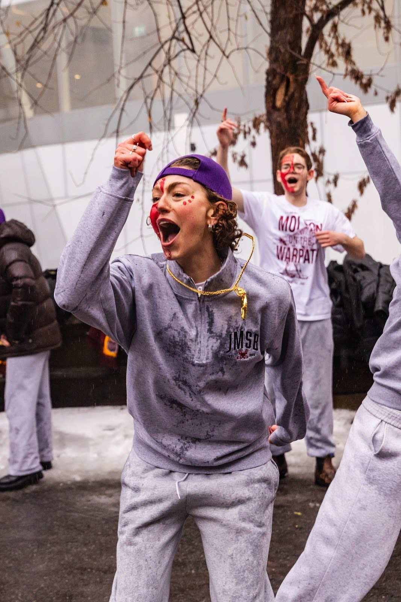
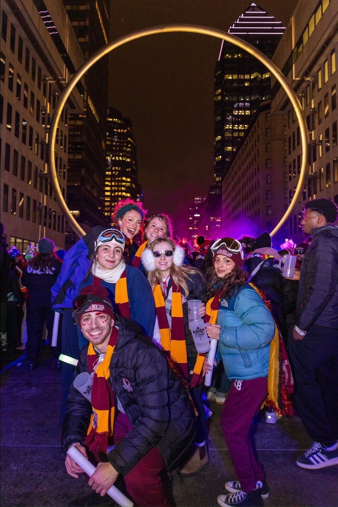
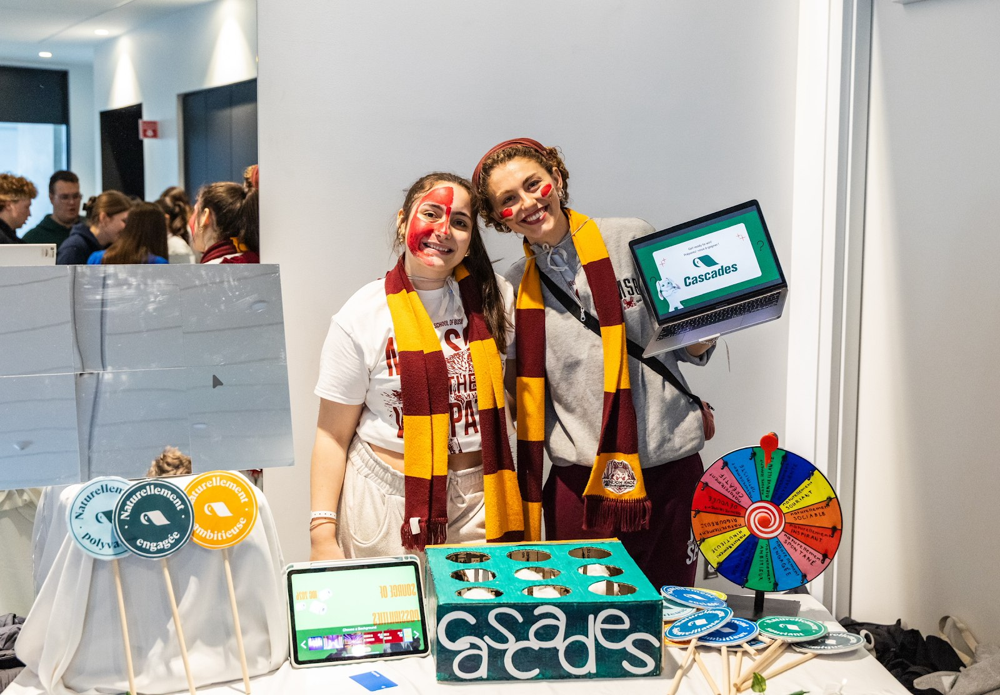
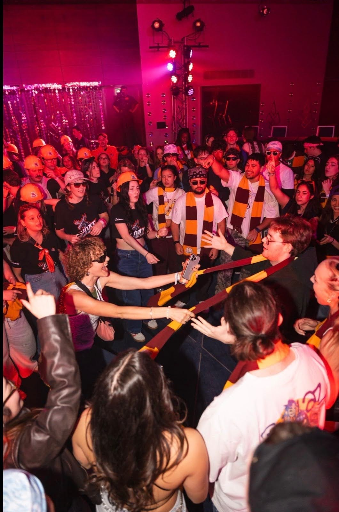
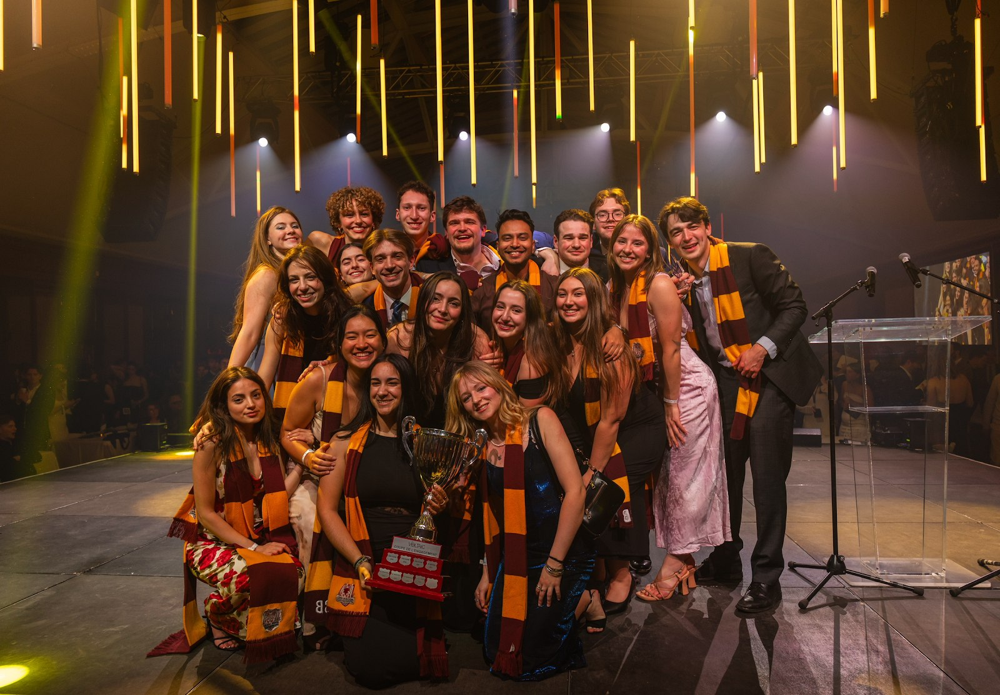

> *In her own words, Lily-Anne Boucher reflects on her first Jeux du Commerce experience as a participation delegate and the role involvement disciplines play in competition.*

**Behind the Podium**

My first JDC experience was nothing short of incredible. Winning first place for the Coupe de l’engagement alongside the social delegates was an unforgettable moment. While we narrowly missed the podium for participation, I was deeply honored to receive the MVP Participation award for Jeux du Commerce 2026.I am incredibly grateful and humbled to have been chosen among such dedicated individuals, both within my own delegation and across all participating universities, who gave their full effort day after day.

**Arriving on Site**

Walking into my first JDC competition as a delegate, I did not fully understand the weight of the role I was stepping into. Like many others, I had heard plenty about the academic disciplines: the long nights of preparation, the pressure, and the prestige. It was only after coming out on the other side of competition weekend that I truly began to understand the role involvement disciplines play. Social, participation, and sports are not simply complementary to the competition. In many ways, they shape the experience from the moment it begins.

From the first interaction in zone tampon, when delegations are greeted by one another, involvement teams set the tone. They are the first point of contact, the first source of energy, and the first signal of a delegation’s identity. It is also often the first moment the entire delegation sees all the partitis together, unified and visible. In that moment, expectations are set. The standard is established. The energy is felt. What follows over the weekend builds directly on that initial impression, shaping how it feels to be part of JMCC.

**Building Identity Before the Weekend Begins**

As a participation delegate, preparation begins months before competition. Our work extends far beyond what is visible on site. We develop the deliverables we are evaluated on, brainstorm creative concepts, and design ideas meant to stand out among dozens of universities. While much of this process is hands on and craft based, participation also functions as a marketing team within the delegation.

**On Site and Under Pressure**

That work comes to life during the competition itself. Participation delegates are responsible for designing activations and booths that engage directly with corporate sponsors, as was the case with Cascades at JDC. Representatives visit the booth, interact with the concepts, and evaluate the ideas we present. Our challenge this year was to create a Cascades booth that facilitated recruitment while remaining aligned with the company’s core values. Our team decided on a multi-step booth, with one of the components being a whack-a-mole made from scratch; for those who have not attempted to make one of those yet,I can assure you it is no small feat. It demanded creativity, problem solving, and constant collaboration, and in working through those challenges together, the participation team grew more cohesive, resilient, and confident.

What becomes clear very quickly is how much participation relies on the presence and support of the entire delegation. When parts of the team are pulled away for volunteer shifts or surprise challenges, every voice and every person matters. Moments where a delegation shows up together, even briefly, make a tangible difference. Those moments are not accidental. They are the result of collective effort and shared commitment.

**Holding the Energy**

Throughout the weekend, involvement delegates carry a visible responsibility. You represent JMCC constantly, often in the most public facing spaces. The expectation is to adapt, collaborate, and perform, even on very little sleep. Ending dégrise at 2 a.m. and starting a volunteer shift half an hour later is not unusual. Still, you show up with a smile and a willingness to help because that is what being a participation delegate demands.

At times, the entire experience feels like a fever dream, but perhaps that is part of its charm. Days blur together, schedules overlap, and exhaustion becomes the norm. Yet within that intensity is a sense of purpose. Being responsible for the atmosphere of the competition means understanding when to lift others up and when to simply be present.

**Connections Beyond the Delegation**

Another defining aspect of the competition is collaboration with other universities. In many ways, participation delegates act as the delegation’s point of connection; in JMSB terms, we are professional networkers. While fraternity is a graded component, it rarely feels transactional. There is an unspoken understanding that everyone around you has committed months of preparation and is navigating the same lack of sleep. Conversations form easily, and connections build quickly, grounded in shared experience rather than obligation.

**What It Takes to Win**

The creativity, coordination, and emotional labor required of involvement disciplines demand a distinct and valuable skill set. Competition success is not built in isolation. It is the result of every discipline showing up with intention and consistency. Together, those efforts create a delegation that is cohesive, visible, and competitive.

> *As Nora, our VP Partiti, has repeated time and time again, you “show up and show out.”*

Perhaps more importantly, it is in the hardest moments that the true value of participation reveals itself. When exhaustion sets in, when your feet ache, your back is sore, your voice is gone, and quitting feels tempting, it is the desire to win and to show up not just for yourself, but for your entire delegation, that keeps you going. It would be dishonest to say those moments do not exist. They do. But knowing the hours you put in, the hours your teammates put in, and the collective effort of the entire delegation makes the idea of looking back and saying “I wish I had done more” unbearable. So you keep going. You show up. You give more than you think you have. As Nora, our VP Partiti, has repeated time and time again, you “show up and show out.”

**Looking Back**

Above all, being a participation delegate is an experience that has singularly shaped my university journey. Coming into JMSB as a first year, JMCC gave me a community and friendships I may never have found otherwise and that I will carry with me far beyond this competition. My first JDC taught me that being an involvement delegate is something to be proud of. It requires leadership, adaptability, and resilience. It plays a direct and essential role in allowing JMCC to compete, and win, at the highest level, and it is a role I am proud to have been a part of.
