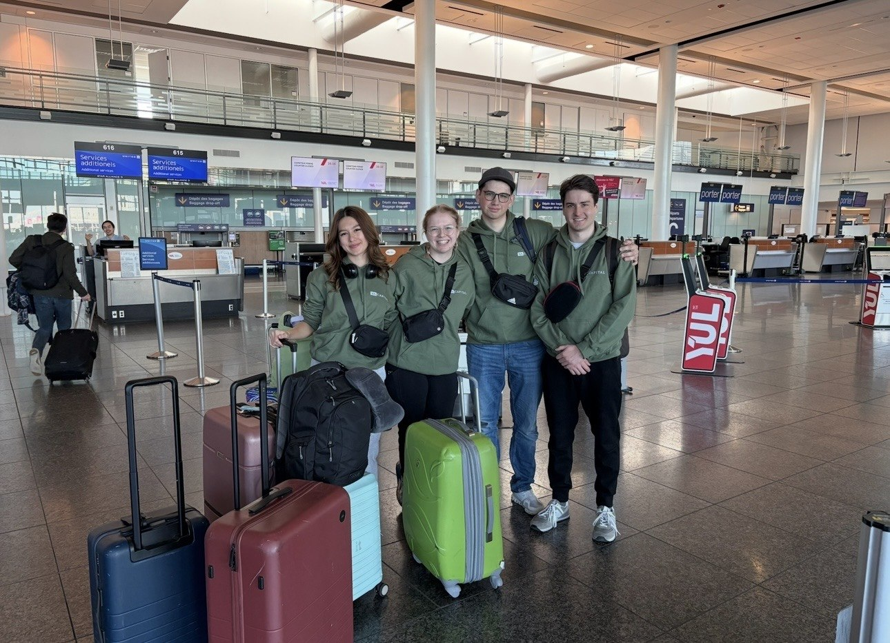
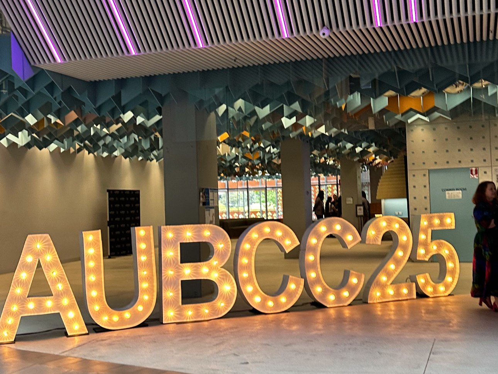
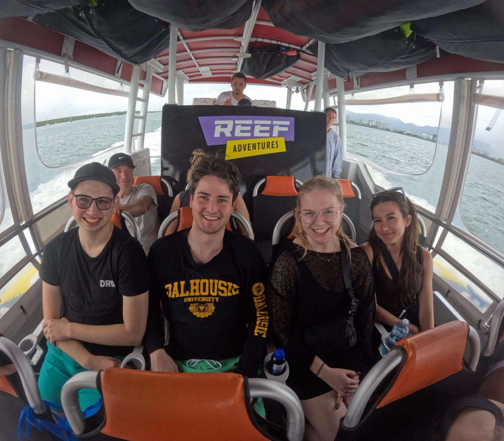

> For Shelby, it was surreal. Just a few years ago, she was just like any other JMSB student trying to find her place. Today, she just landed back in Montreal after representing JMSB at the Australian Undergraduate Business Case Competition (AUBCC). Case competitions began as a way to challenge herself but have turned into a defining part of her academic and professional journey. Here is how she got here!

**From JMSB to the Great Barrier Reef**

With Concordia’s reading week right in sight, Shelby and her teammates decided to make the most of it. “We landed in Melbourne, then took a smaller flight to Cairns to see the Great Barrier Reef. It was a total bucket list moment.” she recalls. After a few days in Sydney exploring Bondi Beach and the Opera House, the team returned to Melbourne to meet their coach and JMCC alumni, Dylan Ross, before competition week began. Between presentations and prep sessions, they still found time to explore the city.

**Inside the Competition**

The competition opened with a ceremony revealing which universities each team would face. “It’s always exciting; that’s when you finally see your matchups,” Shelby says. “We even recognized a delegate from QUT who we’d met at the LA competition earlier this year.” Teams tackled three cases: a five-hour, a three-hour boardroom pitch, and a twelve-hour final. “A typical case day starts around 7 or 8 a.m. with a briefing at 9” but after that, it’s just your team, your laptop, and the countdown clock.

Outside competition hours, AUBCC organized numerous events that mixed delegates from different schools to encourage connections “One of the best parts of these events is connecting with people from all over; we even went to dinner with delegates from QUT, USC, and Florida,” she says.

When asked about how she feels during competitions, she admits, “It’s a bit of a rollercoaster, but in the best way. Case cracking is hard no matter how long you’ve been doing it, but you never stop learning.” And for Shelby, her experience representing JMSB has been about more than just winning. “If you don’t challenge yourself, you’re not learning,” she explains. One of the most valuable lessons she has taken from competing is, “You win or you learn.”

**How Shelby got here**

Shelby’s JMCC journey began somewhat by chance. “I’m from a small town and didn’t know anyone studying business at Concordia. I learned about case competitions while being a Frosh leader in my second year. Someone mentioned JMCC, and it sparked my interest.”

After trying out for JDCC Marketing in 2022, she was offered a spot due to a last-minute drop. “It was pure luck, but it completely changed my undergrad experience,” she says. Since then, she’s competed in Jeux du Commerce Central, Happening Marketing, MICC in Los Angeles, and several others, eventually becoming VP Academics for JMCC.

> ***“****I’ve probably spent over a thousand hours in preps, classes, and competitions. When I started, I was terrified of public speaking; if I didn’t have cue cards, I couldn’t present. Now, I’m confident in front of judges and large audiences. The anxiety never fully disappears, but the preparation gives you confidence.****”***

**Balancing It All**

Balancing a full-time job, school, and competitions is no easy task, but Shelby somehow makes it work. She currently works full-time at her dream job in advertising (with her first-ever case coach as her current boss) while studying full-time and preparing for her next international competition in Porto.

> "This week I had an 8 a.m. call with the UPORTO sponsors, worked my 9–5, then spent the evening on our take-home case. After that, it’s straight into assignments for school. It’s a packed schedule, but worth every moment.”

**Looking Ahead**

Through JMCC, Shelby has built lifelong friendships, an international network, and even launched her career. “I didn’t have a network before JMCC; this community gave me confidence, experience, and connections that opened doors I never knew existed.”

As she heads to Portugal, she reflects on how far she’s come: from a nervous first-time delegate to a seasoned competitor with over 18 competitions under her belt and working her dream job. “You get to represent your university, see the world, and meet incredible people; all on a student budget.”

**Her Advice to Anyone Considering Starting in Case**

> “Just go for it, you’ll grow in ways you never expected”.
