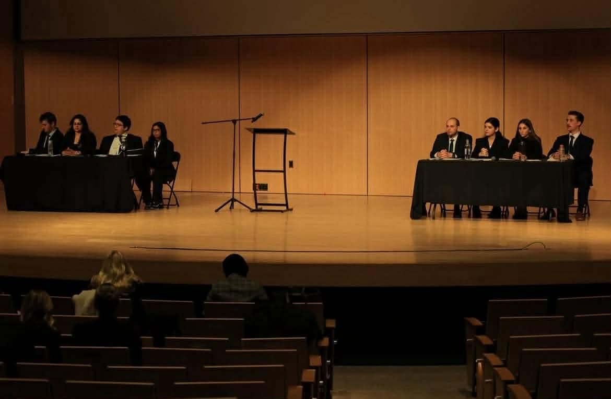

Everything begins with a single motion and a ticking clock.

A motion is handed out. Thirty minutes go on the clock. No scripts. No research notes. No revisions. Four speakers must build and defend a complete case from scratch.

This year, those four were 'Prime Minister' and first speaker Madinah Shaheen, second speaker Marcus Quintanilla, third speaker Arhaana Dubey, and 'The Whip' James Bradley.

To understand how they won, you have to understand how debate works.

### 30 Minutes to Build a Case

Every round starts with a motion. It could be about immigration policy. Trade barriers. Indigenous equity ownership. Medical assistance in dying.

Should Canada cap the number of international students? Should Indigenous communities receive mandatory equity in natural resource projects? Should the federal government remove supply management?

Teams are assigned government or opposition at random. The topic is revealed, the side is assigned, and the clock starts.

The first task is definition. If the motion says “increase,” by how much? If it says “reduce barriers,” which ones? When does the policy begin? Under whose authority? Vague definitions create cracks.

“We define first,” Madinah says. “We build it so there’s no holes they can poke through.” Once the framing is set, they build three arguments. Each must stand alone and survive rebuttal.

Then they step into the room.

### Madinah Shaheen: The Composed Foundation

Madinah opens the round. She defines the motion, outlines the structure, and sets the tone. Her job is control. Too aggressive and judges disengage. Too hesitant and the opposition takes the floor.

“You can’t start too intense,” she says. “You have to be diplomatic.”

Her teammates describe her as steady. She turns prep room chaos into structure.

During one round on Medical Assistance in Dying, she did something she had not done all season. She rejected the opposing team’s definition. They equated MAID with suicide. She argued the equation was inaccurate and redefined the term entirely.

It was a risk. Challenging a definition can seem evasive. But accepting a flawed frame can cost the round before arguments begin.

She reset the terms and the debate shifted.

### Marcus Quintanilla: The Tactician (and encyclopedia)

If Madinah builds the structure, Marcus reinforces it. As second speaker, his role is expansion and refutation. He deepens the case and dismantles the other side.

He describes himself as someone who “knows a little bit of something about a little bit of everything.” His teammates translate it simply: he’s the encyclopedia.

He tracks policy trends. Reads constantly. Falls down research rabbit holes. When a statistic appears mid-round, he often knows its context.

Information alone does not win rounds. Tone does.

Marcus listens for pressure points. When an argument rests on a shaky assumption, he isolates it. When a statistic sounds impressive, he reframes it. His delivery is sharp, occasionally sarcastic, always controlled. A well-placed line can shift the room.

In seven minutes, he uses his wit, and his wealth of knowledge, to propel the motion.

### Arhaana Dubey: The Fire

By the time Arhaana steps up as third speaker, the debate has momentum.

Her role is escalation.

She introduces new arguments while responding to both opposition speakers. Add too much and the case fragments. Repeat too much and it stalls.

Teammates describe her as “incredibly passionate.” She brings the human stakes forward. In debates centered on equity or access, she drives impact. Who benefits? Who bears the cost?

She works closely with James, often decoding his rapid prep notes with ease. Their rhythm is fast and layered. By the end of her speech, the stakes are clear.

### James Bradley: The Whip

The final speech belongs to James, the whip. Throughout the round, he writes down contradictions and logical gaps, looking for ways to “twist their arguments as much as I can.”

He introduces no new arguments. He weighs the ones already on the table.

If the opposition leaned heavily on a statistic, he reframes its relevance. If they built their case on an assumption, he isolates it. If their arguments conflict, he exposes the tension.

By the end of his speech, he tells the judges how to see the case.

The case becomes a single narrative.

### Four Voices, One Case

Each speaker has seven minutes. The middle five allow interruptions that must be answered immediately.

There is no note-passing once a speech begins.

By the final speaker, the judges are not evaluating four individuals. They are judging one construction.

Strategy. Pressure. Escalation. Closure.

Understanding the format explains the structure of a round.

It does not explain the 4 a.m. nerves, the tension in the prep room, or why this team kept saying “when we win” instead of “if.”

A debate is built in thirty minutes, but teams are built long before that.

In the next article, we turn to the competition itself and the story behind this incredible team's achievements.
