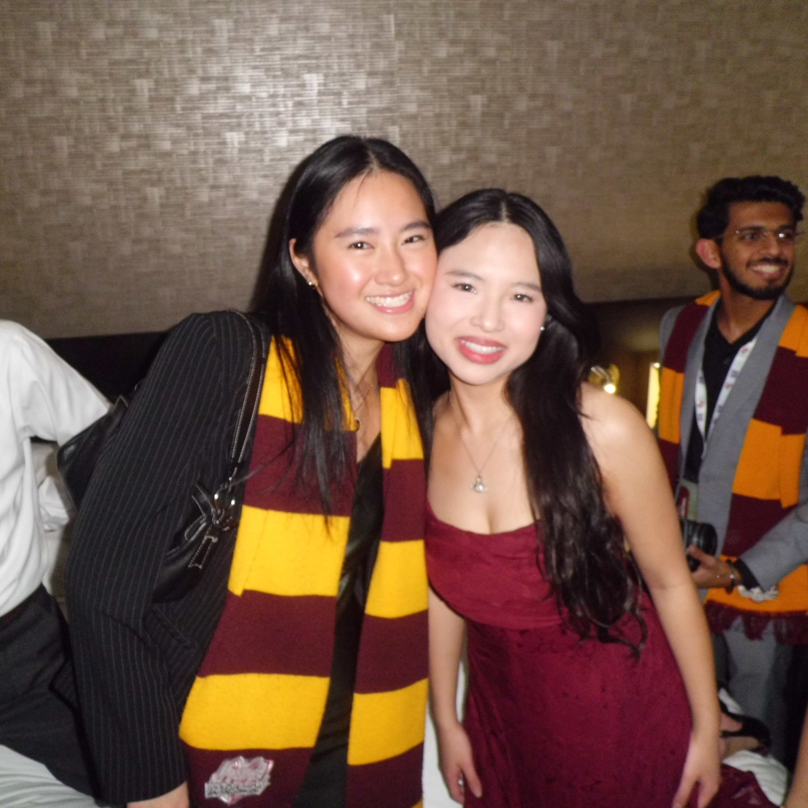
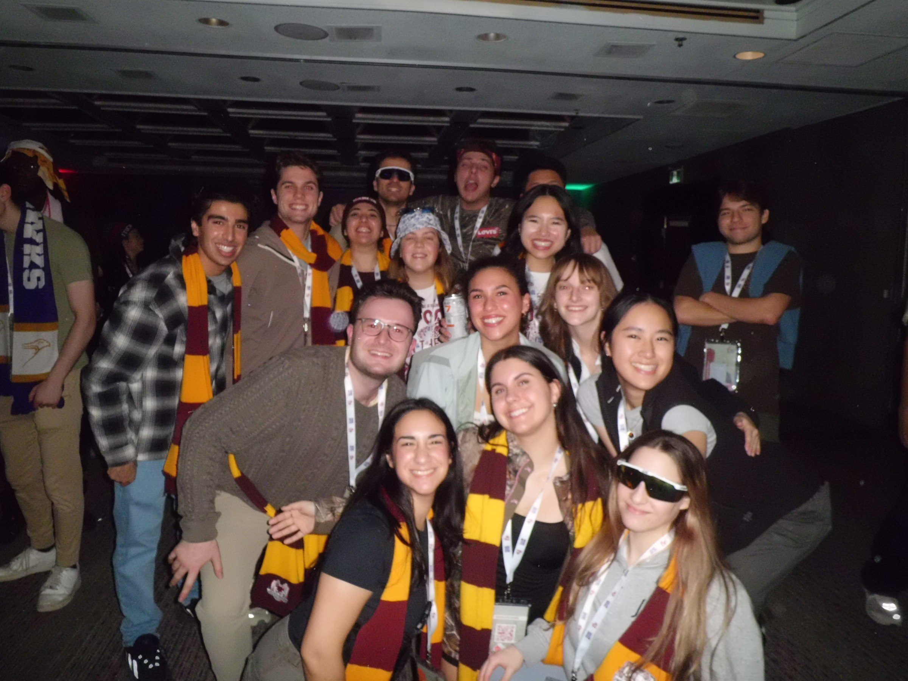
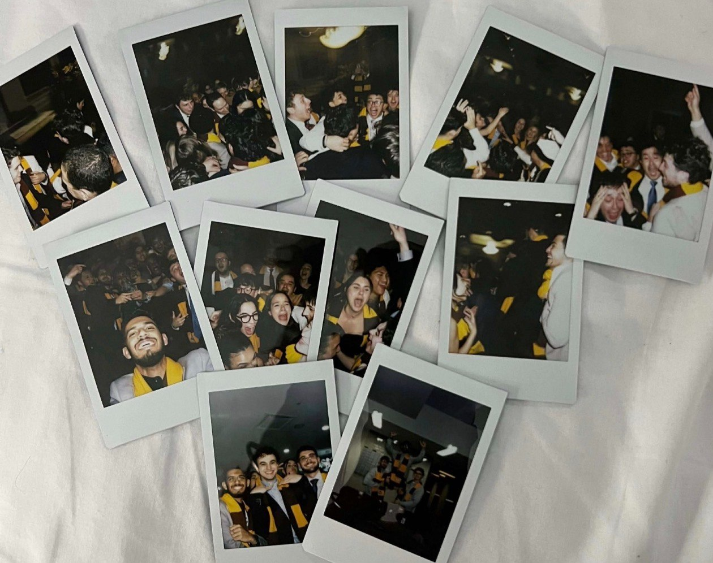
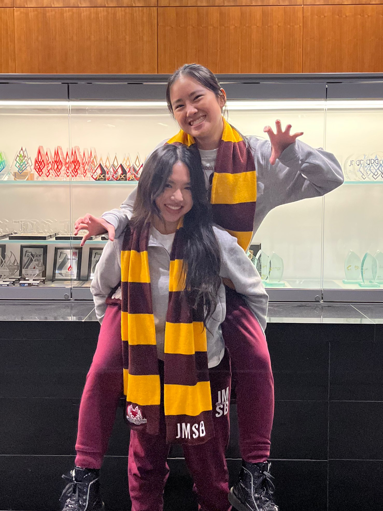
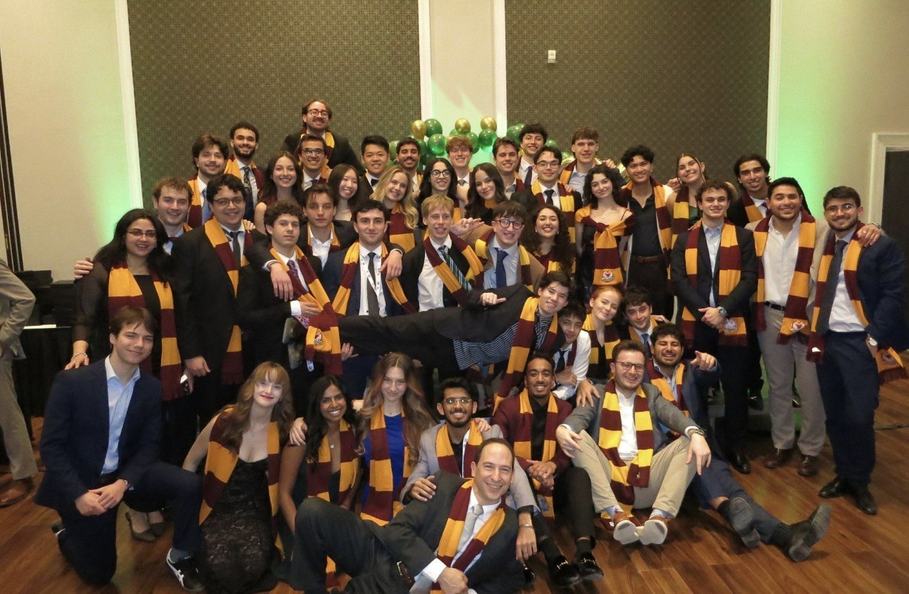

How do you lead a delegation through one of the most demanding business competitions in Canada and walk away with podium finishes across disciplines?

For Pauline, JDCC 2026 was her first year answering that question as captain.

Serving alongside Ann, she stepped into the role after competing as a delegate the year prior. The transition reshaped her understanding of what JDCC truly demands. As she put it, being captain meant being “part hype squad, part problem solver, part sleep-deprived parent, and all cheerleader.” Over three days, captains manage more than morale. They oversee logistics, coordinate with godparents and internals, and steady a delegation navigating multiple competitions at once.

JDCC brings together over 500 business students from Central and Eastern Canada to compete in academics, debate, sports, and social challenges. While delegates focus on performance, captains manage the moving pieces behind the scenes and ensure everything runs smoothly under pressure.

The pressure paid off.

At Gala, the JMSB delegation podiumed across disciplines, including 3rd Place Academic Cup, 2nd Place in Entrepreneurship, and 3rd Place in Debate, marking the program’s first debate podium in 13 years. Individual awards included MVP for Jacob Beaudet and Golden Tickets for Matheshan Mohanaseelan, Sebastian Kornhauser, and Badr Lotfi.

The results were significant. What stood out in speaking with Pauline, however, was how quickly she redirected credit back to the delegation. “Showing up for each other, constant support, energy, and determination from every member of the delegation, was our most underrated skill.”

That collective momentum was especially visible the night of AGM, the Annual General Meeting held before competitions begin. It was one of the final moments before formal judging took over. The room was filled with chants, anticipation, and nervous energy. “Everyone was so excited to cheer each other on… and in that moment, it all started to feel real,” she recalled.

It was not strategy that defined that night. It was alignment. Preparation had turned into belief.

When asked about the hardest part of being captain, Pauline did not mention exhaustion or logistics. “Managing emotions when times get tough,” she said. The role is as much emotional as operational. Her first emotion walking into JDCC was “nervous but excited.” That balance defined the weekend.

One podium carried particular weight. The 3rd Place Academic Cup stood out because most of the delegation were first-time competitors. The result validated months of preparation and proved that new delegates could rise quickly under pressure.

When asked what she would carry forward, she did not mention trophies. Instead, she pointed to “the bond within our delegation and the unforgettable experiences we shared throughout the competition.”

Her advice to future delegates is practical. “Sleep any chance you get.” But her broader philosophy offers the clearest answer to the question this article began with. “Do the best that you can, because that’s all that you can do. Anything can happen, especially at a competition. Work hard, and the results might surprise you in the end.”

In a competition defined by unpredictability, her approach was not about controlling outcomes. It was about preparation, composure, and collective belief. And if JDCC 2026 revealed anything, it was visible not just in the trophies, but in the delegation standing behind them.
