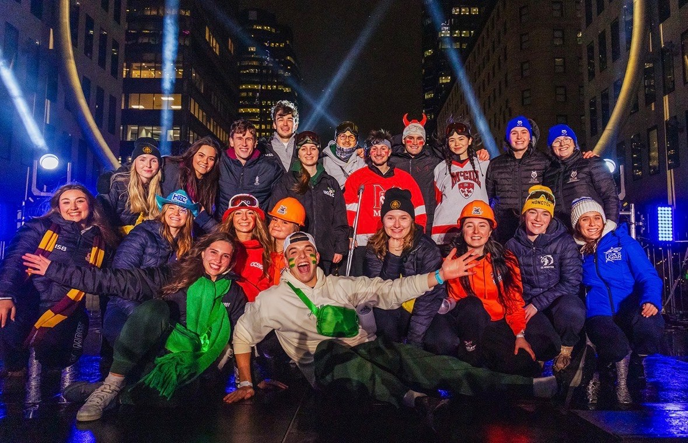
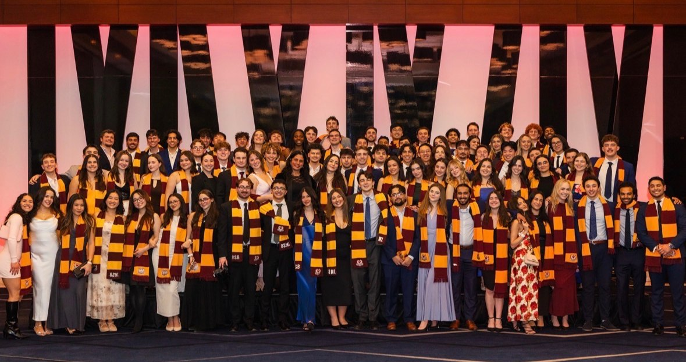
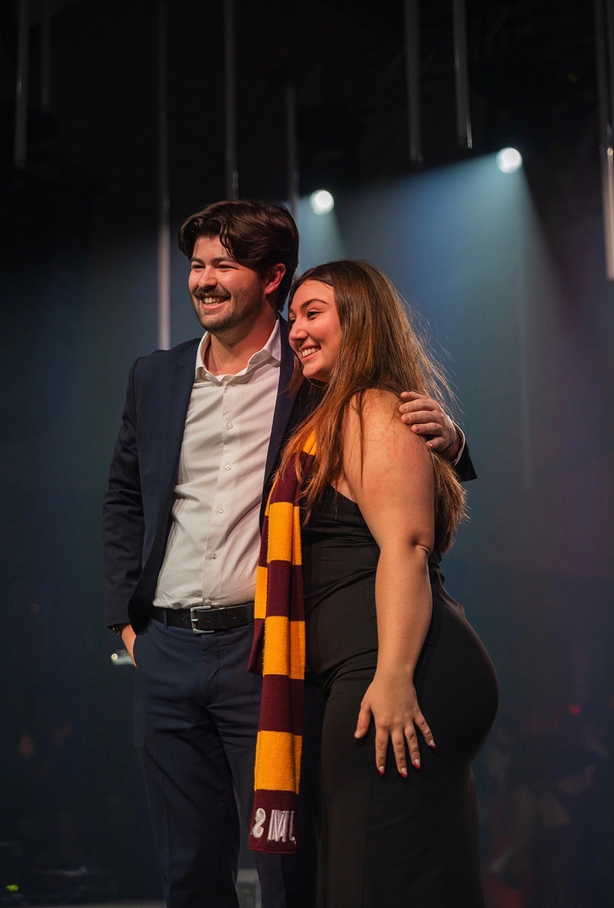
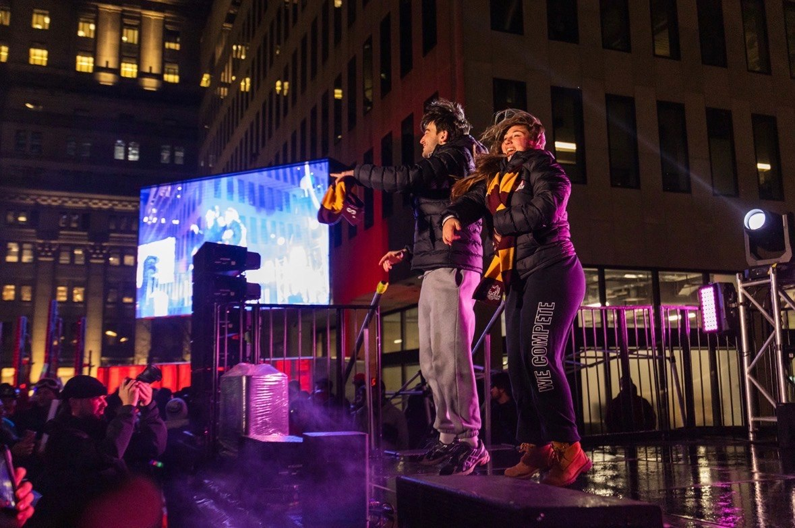

This year’s JDC marked an important moment for JMSB. With ten podium finishes and a weekend defined by both success and pressure, the results spoke for themselves. Behind those outcomes, however, was a team navigating long weeks, unexpected challenges, and significant responsibility. At the centre of it all was Ally Boucher, whose experience as coordinator proved to be more meaningful than she had anticipated.

**Stepping Into the Role**

When asked to describe her time as a cordo, Ally did not hesitate.

“It was honestly better than I could have expected,” she shared. “There were a lot of challenges that came up unexpectedly, but in the end, it didn’t really matter. The delegation I had and the people working by my side made everything work.”

That sense of pride stayed with her throughout the weekend. While being responsible for so much felt unfamiliar at times, Ally consistently points back to her team. She credits them for shaping the experience and making the role feel manageable. “I really could not have asked for a better group of people to work with. I am just so proud of everyone.”

**Finding JMCC and JDC**

Ally’s JDC journey began three years ago as a participation delegate, an experience that quickly drew her in. “I absolutely fell in love with the discipline,” she said. “I had so much fun, and I had friends in all the different competitions. That really helped me understand what JDC was all about.”

The following year, she returned as an internal VP of participation. Although she was no longer competing, the role offered a new perspective. “It was a totally different experience. I was not competing anymore, but I was still very involved. I loved the atmosphere, and from that point on, I knew I wanted to be a coordinator.”

**What it takes?**

Behind the scenes, the role demanded constant attention. Ally described a typical week as a balance of meetings, communication, and problem solving. “I would wake up, check my deliverables to make sure nothing was missed, go to class, and somehow end up doing JDC work instead of paying attention,” she said. “I had around ninety delegates reaching out almost every day.”

**Competition weekend**

When questions came up that she did not immediately have answers to, Ally relied on past resources and the network around her. “I would go through old guides or reach out to other coordinators. You build really strong connections with people from other schools, and that helps more than you realize.”

Competition weekend brought a different kind of pressure, especially in the hours leading up to the start. “Making sure everyone had their merch and that nothing was missing was when it really hit,” she explained. Once the competition was underway, that stress shifted. “Watching everyone perform the way we expected was such a relief. We did not get much sleep, but it was completely worth it.”

One of the most unexpected moments of the weekend came when Ally was named the first ever recipient of the Elevation Award. “I truly did not expect it,” she shared. “I was still so caught up in celebrating my delegates and their success that it did not even register. When I heard my name, I was completely shocked.”

For Ally, the recognition was never about the title itself, but about what it represented. “I was always asking how I could help, thanking the OC, and trying to support other teams when issues came up,” she said. “When there were problems, I spoke up, even when no one else did. I think that mattered.”

**Growth and leadership in practice**

The coordinator role also pushed Ally to grow in ways she did not anticipate. When her co coordinator accepted an internship in Toronto, she found herself taking on more responsibility than originally planned. “At first, I was really nervous,” she admitted. “I did not know how I wanted to lead, whether that meant being more strict or more friendly.”

Over time, she found her balance. “These people are my friends, but they also respect me. I was there to support them throughout the year, and because of that, when I needed to step up, they listened. That helped me understand my leadership style.”

When asked what advice she would give to students considering becoming a JDC coordinator, Ally was certain. “Do it,” she said. “I have no regrets. It was the most fun experience I have had in university. Being able to support people, represent your school, and help others become the best versions of themselves means everything.”

Looking back, Ally’s story reflects what JDC offers beyond results alone. It is an experience shaped by growth, leadership, and the willingness to show up for others, even when things do not go as planned. For Ally, it is an experience she would choose again in a heartbeat.
