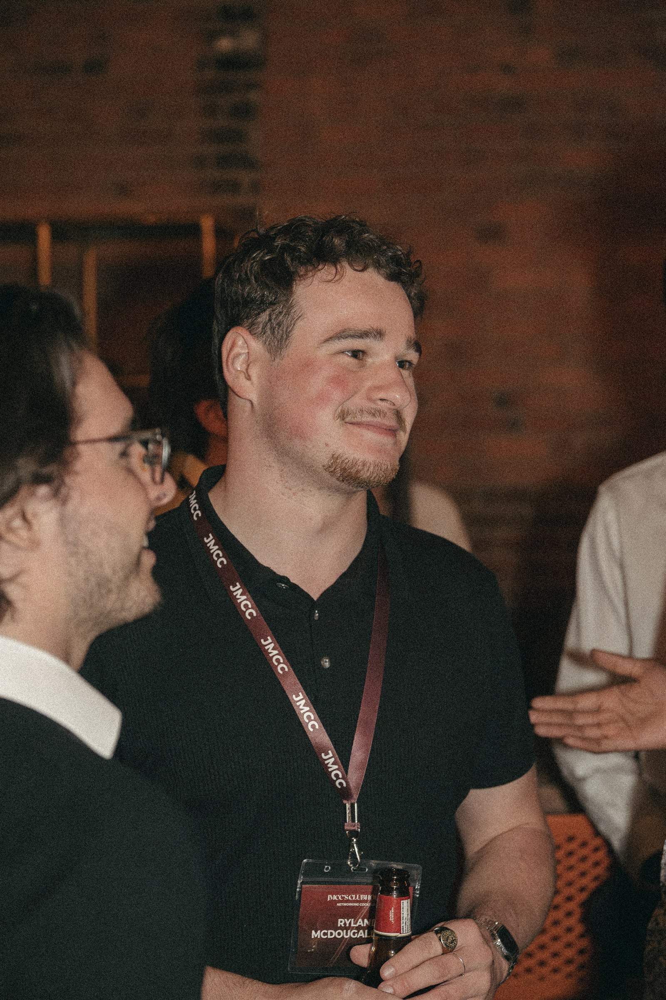
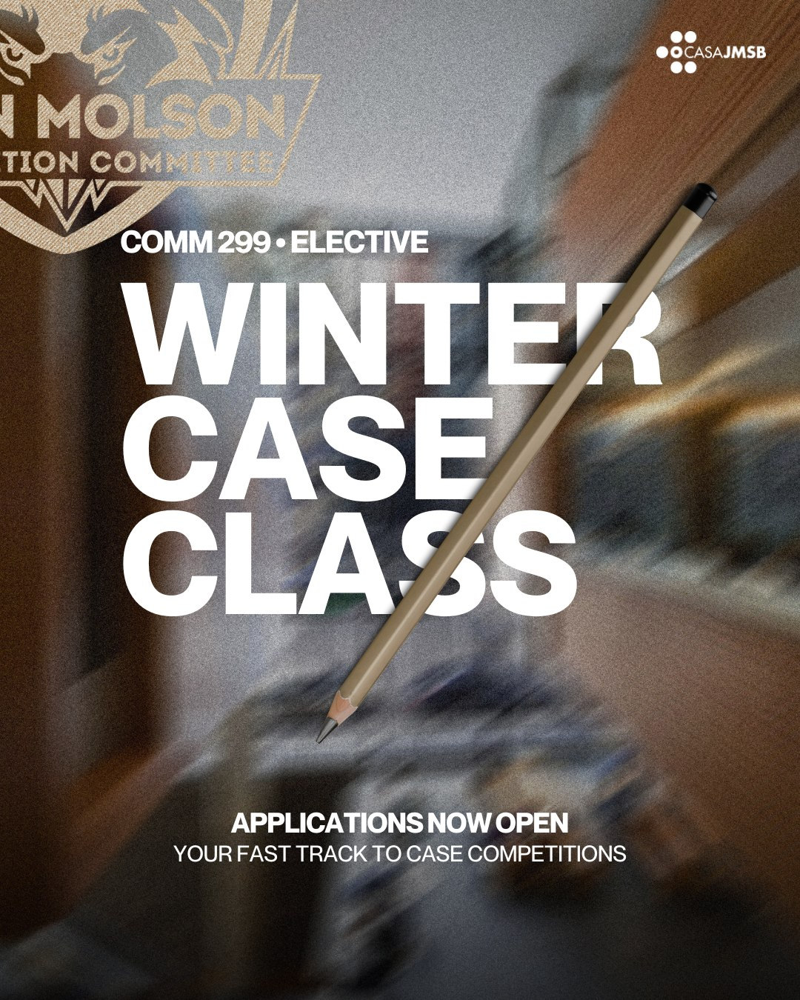

> *When asked what he thinks when he sees case competition experience on a résumé, David Lopez-Leclerc, talent development and campus recruiter specialist at ScotiaBank, put it simply: “It grabs my attention immediately.” David agreed to sit down with JMCC to share his insights:*

**Why Case Competitions Matter More Than You Think**

Going beyond the typical academic path, pushing yourself out of your comfort zone, and taking on team-based challenges are not just résumé boosters; they’re indicators of initiative, adaptability, and maturity. And recruiters value that tremendously.

When asked what case competition experience signals about a candidate, David mentions the skills like “being able to think critically and solve complex problems… It also highlights their ability to work well in a team… On top of that, case competitions demand strong communication and presentation skills.”

He, like many, see case competitors as proof that “the candidate has sought out real-world problem-solving opportunities” and stepped into “high-pressure, collaborative environments.” In other words: this candidate stands out.

These are the exact traits employers look for, especially in competitive industries.

**The Skills Recruiters Know You Have**

> *“What really matters isn’t just the outcome, but the skills you build along the way and the connections you make throughout the process.” - David*

Whether you realize it or not, case competitions build the most sought-after skills in today’s job market: Critical thinking & problem-solving, Teamwork & leadership, and Effective communication & presentation.

These are the foundation of every strong application. And case competitions prove you’ve practiced them under real pressure. You don’t need to place first to stand out. In fact, recruiters often care far more about the process than the final result. Competing gives you what classrooms can’t: lived experience. When it’s time to tell your story, you’ll have tackled real challenges, gained sharper insights, and built the confidence to present bold ideas.

**Your next interview**

You'll have generated creative and innovative solutions, navigated time pressure, balanced team responsibilities and structured and delivered dozens of presentations. All that will be left is to talk about your life-changing experience. David's advice:

> *“Share what happened… explain the skills you built… and connect the experience back to the role you’re applying for. That’s what gives you a distinctive edge."*

**Where do I start?**

Want to get started in case competing? You're in luck - COMM 299 Winter Case Class applications are now open. Learn everything you need to tryout for the 2026-2027 season, this coming winter!

[LEARN MORE AND APPLY TODAY](https://www.jmccjmsb.ca/comm299-recruitment)
