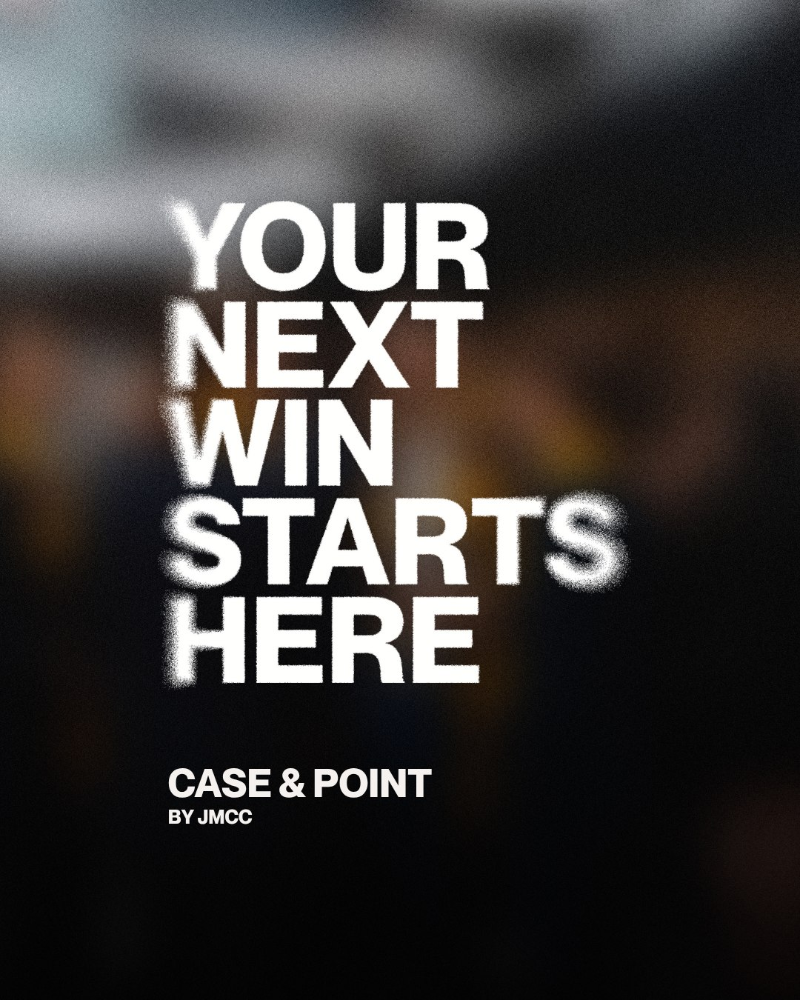

> You want to land your dream offer. Lead a team. Walk into high-pressure presentations with confidence. Build a career in business that actually excites you.The students who get there aren't winging it. They know the frameworks. They understand what works under pressure. Now you will too.

## What You're Getting

Case & Point is where JMCC shares everything we've developed over two decades of training competition winners—the strategies, frameworks, and insights that help students dominate cases and launch incredible careers. Here's what you'll find every week

### How to Compete

Learn the frameworks that work when you have 3 hours and a 40-page case. Time management systems. How to structure your analysis. Stage presence and storytelling that keeps judges engaged. Slide design that actually works. How to handle tough Q&A without freezing. The presentation techniques that win.

### Delegate Stories

Real journeys from JMCC competitors. How they prepared for their first competition. The frameworks they used to win nationals. Where they are now—the consulting offers, the leadership roles, the careers they built. What they'd do differently. The mistakes that taught them the most. Learn from students who've been exactly where you are.

### Getting Started

Your first case competition: what to expect, how to prep, how to get involved with JMCC. Competition types and calendars. How to build your competition resume. Finding your niche—whether that's strategy, marketing, or debate.

Every post is tactical. Every strategy is tested. Every framework comes from real wins.

## Why You Should Read

Because these skills directly translate to the career you want. Case competition training teaches you to think fast, present persuasively, and perform under pressure. Those are the exact skills that land consulting offers, earn promotions, and build leadership careers.

Whether you compete with JMCC, try your first case independently, or just want to sharpen your business skills—this playbook gives you the system that works.

## Ready to level up?

- [Your First Case Competition: What to Expect](/blog/your-first-case-competition-a-complete-guide)
- The 5-Step Framework for Cracking Cases
- How Sarah Won JDCC and Landed at McKinsey

New posts every week.

**Your next win starts here.**
