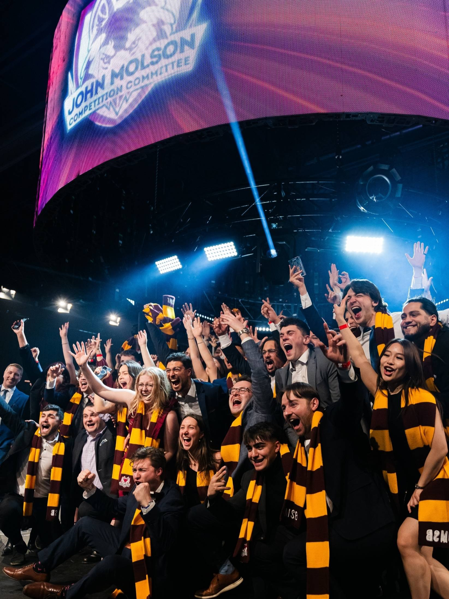
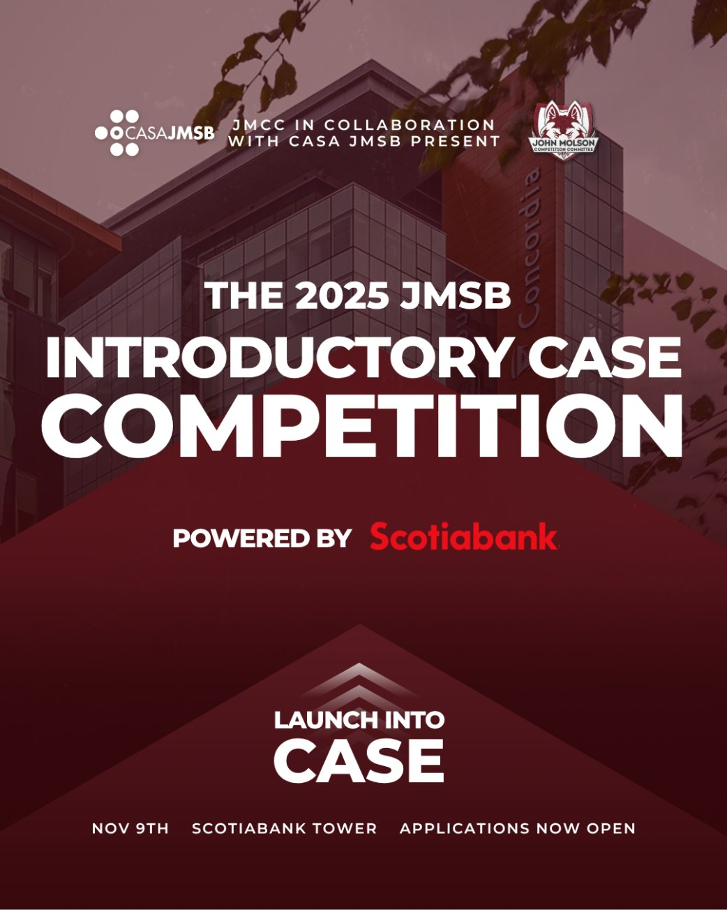

> Want to crack cases, present under pressure, and build skills that land consulting offers? JMCC has spent two decades engineering the competitors who win. Here's how to become one.

## Three Paths to Launching Into Case

### Path 1. Try It First: Internal Case Competitions

Throughout the year, JMCC partners with sponsor companies to host internal case competitions open to all JMSB students. These one-day events give you a real taste of what case competitions feel like—you'll work with a team to crack an actual business case and present your solution to company executives. It's the perfect low-stakes entry point to see if competitions are for you, meet other ambitious students, and network with industry professionals. No experience required, and there's no long-term commitment.

**On November 9th, we're hosting the Scotiabank Internal Case Competition**

You'll get a pre-competition workshop teaching you the fundamentals, then spend four hours working on a real Scotiabank case with your team before presenting to their executives.

It's designed specifically for beginners and is the perfect way to launch into case. Last year, 18% of participants went on to become JMCC delegates. Only 40 spots available—applications close October 28th

[Apply now](https://docs.google.com/forms/d/e/1FAIpQLSdMrMzSHvFZrCWgQ6ktWfPYr8RNLUdUmkYs2YBmBG3K-Va9Dg/viewform?usp=sharing&ouid=108600481955011648139)

### Path 2. Learn the System: COMM 299

Never competed before? COMM 299 is your foundation. One semester, three hours per week, covering frameworks, presentations, and time management. You'll practice real cases and get feedback from experienced coaches. Open to any JMSB student. Applications open at the start of each semester.

### Path 3. Skip to Tryouts

Already confident? Tryout directly for delegate spots without the course. Regional competitions recruit every September. JDC and JDCC nationals recruit every June for the following year. Tryouts are competitive: we select delegates based on analytical thinking, presentation skills, and team fit.

## Where You'll Compete as a Delegate

Once you're selected as an academic delegate, here's where you can expect to compete:

### Regional Competitions

Regionals are your entry point to the circuit. HR Sympo focuses on human resources and organizational strategy, FO tests financial analysis and corporate finance skills, and HM challenges you on marketing strategy and brand positioning.

**RECRUITMENT**

Throughout the fall (for that academic year)

**COMPETITIONS**

HR Sympo (November)

FO (January)

HM (March)

**WHO COMPETES**

First-time delegates and those building competition experience

### National Competitions

JDC and JDCC are Canada's premier academic case competitions where schools send their best across every business discipline. These are the most competitive, most intense competitions of the year.

**RECRUITMENT**

June (for the following January)

**COMPETITIONS**

JDC (January)

JDCC (January)

**WHO COMPETES**

COMM 299 graduates, experienced regional competitors, other JMSB students that show promise well during tryouts

### International Competitions

Once you've competed successfully at regionals or nationals, you become eligible to represent JMSB at international competitions around the world. Veteran delegates with proven track records at regionals or nationals compete in internationals.

## Your Next Win Starts Here

**Ready to get started?** If you want to try case competitions first, apply to our next internal case competition. If you want structured training, register for COMM 299 when it opens each semester. If you're ready to tryout directly, watch for delegate recruitment at the start of the academic year (regionals) or summer (nationals). JMCC has spent twenty years engineering winners. It's your turn.
